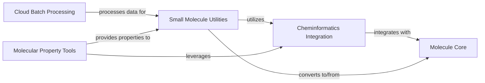

## Component Details

This subsystem focuses on the comprehensive handling of molecular data, particularly small molecules, by integrating with external cheminformatics libraries and leveraging cloud-based processing for scalability. It provides core molecular representation, utilities for small molecule manipulation, and tools for calculating various molecular properties, all while enabling distributed computation through cloud batch services.

### Cheminformatics Integration

This component provides the core functionalities for integrating `moleculekit` with external cheminformatics libraries such as RDKit and OpenBabel. It handles the conversion of molecular objects to and from these external formats, and leverages their capabilities for various chemical operations and property calculations.

**Related Classes/Methods**:

- `moleculekit.rdkitintegration` (full file reference)

- `moleculekit.tools.obabel_tools` (full file reference)

### Small Molecule Utilities

This component focuses on the representation and manipulation of small molecules. It provides functionalities for initializing, sanitizing, modifying, and analyzing small molecules, including conformer generation, alignment, and various property retrievals. It also handles conversions to and from the core `Molecule` object and integrates with external data sources for ligand information.

**Related Classes/Methods**:

- `moleculekit.smallmol` (full file reference)

- `moleculekit.smallmol.util` (full file reference)

### Cloud Batch Processing

This component provides functionalities for interacting with Google Batch for scalable execution of computational tasks. It manages job submission, status monitoring, and data transfer to and from cloud storage, enabling distributed molecular simulations or analyses.

**Related Classes/Methods**:

- `moleculekit.docker.google_batch.googlebatchwrapper` (full file reference)

### Molecular Property Tools

This component encompasses various tools for calculating and extracting molecular properties and features. This includes atom typing (e.g., PDBQT), generating voxel descriptors, and leveraging external cheminformatics libraries like OpenBabel for property retrieval and format conversions.

**Related Classes/Methods**:

- `moleculekit.tools.atomtyper` (full file reference)

- `moleculekit.tools.voxeldescriptors` (full file reference)

### Molecule Core

This component defines the fundamental `Molecule` object, which is a central data structure for representing molecular information within the `moleculekit` library. It provides methods for manipulating molecular data, including atom and bond information, coordinates, and conversions to and from other molecular formats.

**Related Classes/Methods**:

- `moleculekit.molecule` (full file reference)

### [FAQ](https://github.com/CodeBoarding/GeneratedOnBoardings/tree/main?tab=readme-ov-file#faq)