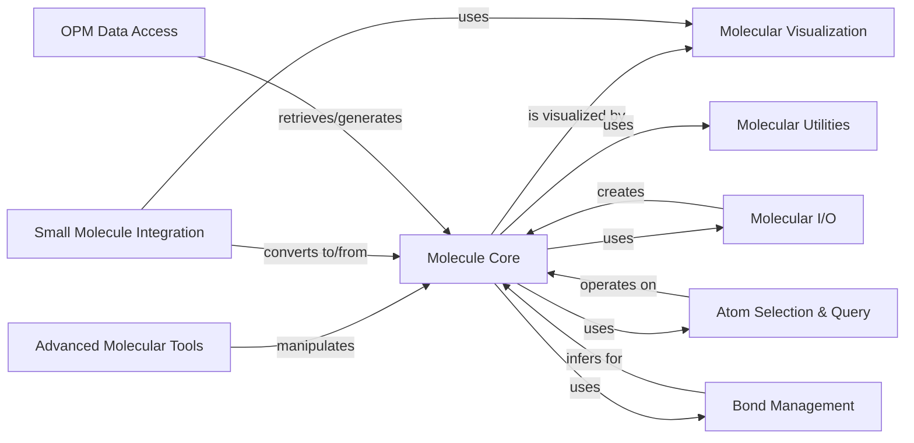

## Component Details

This architecture defines the core components for handling molecular data, from fundamental representation to advanced analysis and visualization. The central `Molecule Core` component serves as the primary data structure, storing atomic properties, coordinates, and connectivity. `Molecular I/O` manages the persistence of this data, enabling reading and writing from various file formats. `Atom Selection & Query` provides a powerful mechanism for selecting and analyzing subsets of atoms within a molecule. `Bond Management` is responsible for inferring and manipulating chemical bonds. `Molecular Visualization` allows for interactive display of molecular structures. `Small Molecule Integration` facilitates interaction with external small molecule databases and libraries. `Advanced Molecular Tools` offers specialized functionalities for complex tasks like docking and modeling. Finally, `OPM Data Access` provides specific functionalities for interacting with the Orientations of Proteins in Membranes (OPM) database. `Molecular Utilities` provides general-purpose helper functions used across various components.

### Molecule Core

The fundamental data structure for representing molecular systems, including atomic properties, coordinates, and connectivity. It provides core functionalities for manipulating and querying molecular data.

**Related Classes/Methods**:

- <a href="https://github.com/Acellera/moleculekit/blob/master/moleculekit/molecule.py#L192-L2963" target="_blank" rel="noopener noreferrer">`moleculekit.molecule.Molecule` (192:2963)</a>

- <a href="https://github.com/Acellera/moleculekit/blob/master/moleculekit/molecule.py#L3291-L3345" target="_blank" rel="noopener noreferrer">`moleculekit.molecule.calculateUniqueBonds` (3291:3345)</a>

- <a href="https://github.com/Acellera/moleculekit/blob/master/moleculekit/molecule.py#L149-L189" target="_blank" rel="noopener noreferrer">`moleculekit.molecule._atoms_to_sequence` (149:189)</a>

- <a href="https://github.com/Acellera/moleculekit/blob/master/moleculekit/molecule.py#L14-L19" target="_blank" rel="noopener noreferrer">`moleculekit.molecule.TopologyInconsistencyError` (14:19)</a>

- <a href="https://github.com/Acellera/moleculekit/blob/master/moleculekit/molecule.py#L2966-L3061" target="_blank" rel="noopener noreferrer">`moleculekit.molecule.UniqueAtomID` (2966:3061)</a>

- <a href="https://github.com/Acellera/moleculekit/blob/master/moleculekit/molecule.py#L3064-L3158" target="_blank" rel="noopener noreferrer">`moleculekit.molecule.UniqueResidueID` (3064:3158)</a>

- <a href="https://github.com/Acellera/moleculekit/blob/master/moleculekit/molecule.py#L3161-L3267" target="_blank" rel="noopener noreferrer">`moleculekit.molecule.mol_equal` (3161:3267)</a>

- <a href="https://github.com/Acellera/moleculekit/blob/master/moleculekit/molecule.py#L3280-L3288" target="_blank" rel="noopener noreferrer">`moleculekit.molecule._getResidueIndexesByAtom` (3280:3288)</a>

### Molecular I/O

Handles the reading and writing of molecular data from and to various file formats, converting external data representations into Molecule objects and vice-versa.

**Related Classes/Methods**:

- `moleculekit.readers` (full file reference)

- `moleculekit.writers` (full file reference)

- `moleculekit.pdbx.reader` (full file reference)

- `moleculekit.pdbx.writer` (full file reference)

- `moleculekit.fileformats` (full file reference)

### Atom Selection & Query

Provides a powerful language for selecting subsets of atoms within a molecule and performing basic analytical queries on these selections.

**Related Classes/Methods**:

- <a href="https://github.com/Acellera/moleculekit/blob/master/moleculekit/atomselect/atomselect.py#L269-L286" target="_blank" rel="noopener noreferrer">`moleculekit.atomselect.atomselect.atomselect` (269:286)</a>

- <a href="https://github.com/Acellera/moleculekit/blob/master/moleculekit/atomselect/analyze.py#L66-L135" target="_blank" rel="noopener noreferrer">`moleculekit.atomselect.analyze.analyze` (66:135)</a>

- `moleculekit.atomselect.languageparser` (full file reference)

### Bond Management

Focuses on the detection and manipulation of chemical bonds within molecular structures, including algorithms for guessing bonds when not explicitly defined.

**Related Classes/Methods**:

- <a href="https://github.com/Acellera/moleculekit/blob/master/moleculekit/bondguesser.py#L125-L149" target="_blank" rel="noopener noreferrer">`moleculekit.bondguesser.guess_bonds` (125:149)</a>

- <a href="https://github.com/Acellera/moleculekit/blob/master/moleculekit/bondguesser.py#L152-L195" target="_blank" rel="noopener noreferrer">`moleculekit.bondguesser.guess_bonds_rdkit` (152:195)</a>

### Molecular Utilities

A collection of general-purpose functions and helper classes that support various operations on molecular data, often used by other components.

**Related Classes/Methods**:

- `moleculekit.util` (full file reference)

- <a href="https://github.com/Acellera/moleculekit/blob/master/moleculekit/dihedral.py#L18-L53" target="_blank" rel="noopener noreferrer">`moleculekit.dihedral.dihedralAngle` (18:53)</a>

- `moleculekit.distance.pdist` (full file reference)

- `moleculekit.periodictable` (full file reference)

- `moleculekit.unitcell` (full file reference)

- `moleculekit.align` (full file reference)

- `moleculekit.projections` (full file reference)

- `moleculekit.interactions` (full file reference)

### Molecular Visualization

Enables the interactive display of molecular structures and trajectories using various external rendering backends.

**Related Classes/Methods**:

- <a href="https://github.com/Acellera/moleculekit/blob/master/moleculekit/molecule.py#L3385-L3529" target="_blank" rel="noopener noreferrer">`moleculekit.molecule.Representations` (3385:3529)</a>

- <a href="https://github.com/Acellera/moleculekit/blob/master/moleculekit/molecule.py#L3532-L3558" target="_blank" rel="noopener noreferrer">`moleculekit.molecule._Representation` (3532:3558)</a>

- `moleculekit.viewer` (full file reference)

- `moleculekit.vmdviewer` (full file reference)

- `moleculekit.pymolgraphics` (full file reference)

- `moleculekit.vmdgraphics` (full file reference)

### Small Molecule Integration

Facilitates the interaction with and conversion of small molecule data, often involving external libraries like RDKit or databases.

**Related Classes/Methods**:

- <a href="https://github.com/Acellera/moleculekit/blob/master/moleculekit/smallmol/smallmolcdp.py#L6-L243" target="_blank" rel="noopener noreferrer">`moleculekit.smallmol.smallmolcdp.SmallMolCDP` (6:243)</a>

- <a href="https://github.com/Acellera/moleculekit/blob/master/moleculekit/smallmol/smallmol.py#L50-L1223" target="_blank" rel="noopener noreferrer">`moleculekit.smallmol.smallmol.SmallMol` (50:1223)</a>

- <a href="https://github.com/Acellera/moleculekit/blob/master/moleculekit/smallmol/util.py#L27-L76" target="_blank" rel="noopener noreferrer">`moleculekit.smallmol.util.getRCSBLigandByLigname` (27:76)</a>

- <a href="https://github.com/Acellera/moleculekit/blob/master/moleculekit/smallmol/util.py#L79-L141" target="_blank" rel="noopener noreferrer">`moleculekit.smallmol.util.getChemblLigandByDrugName` (79:141)</a>

- <a href="https://github.com/Acellera/moleculekit/blob/master/moleculekit/smallmol/util.py#L144-L210" target="_blank" rel="noopener noreferrer">`moleculekit.smallmol.util.getChemblSimilarLigandsBySmile` (144:210)</a>

- `moleculekit.rdkitintegration` (full file reference)

### Advanced Molecular Tools

A suite of specialized tools for complex molecular tasks such as crystal packing, molecular docking, and protein modeling.

**Related Classes/Methods**:

- <a href="https://github.com/Acellera/moleculekit/blob/master/moleculekit/tools/crystalpacking.py#L82-L180" target="_blank" rel="noopener noreferrer">`moleculekit.tools.crystalpacking.generateCrystalPacking` (82:180)</a>

- <a href="https://github.com/Acellera/moleculekit/blob/master/moleculekit/tools/docking.py#L31-L224" target="_blank" rel="noopener noreferrer">`moleculekit.tools.docking.dock` (31:224)</a>

- <a href="https://github.com/Acellera/moleculekit/blob/master/moleculekit/tools/preparation_customres.py#L45-L104" target="_blank" rel="noopener noreferrer">`moleculekit.tools.preparation_customres._template_residue_from_smiles` (45:104)</a>

- <a href="https://github.com/Acellera/moleculekit/blob/master/moleculekit/tools/preparation_customres.py#L285-L326" target="_blank" rel="noopener noreferrer">`moleculekit.tools.preparation_customres._convert_amber_prepi_to_pdb2pqr_residue` (285:326)</a>

- <a href="https://github.com/Acellera/moleculekit/blob/master/moleculekit/tools/atomtyper.py#L207-L265" target="_blank" rel="noopener noreferrer">`moleculekit.tools.atomtyper.atomtypingValidityChecks` (207:265)</a>

- <a href="https://github.com/Acellera/moleculekit/blob/master/moleculekit/tools/graphalignment.py#L100-L163" target="_blank" rel="noopener noreferrer">`moleculekit.tools.graphalignment.maximalSubstructureAlignment` (100:163)</a>

- <a href="https://github.com/Acellera/moleculekit/blob/master/moleculekit/tools/moleculechecks.py#L98-L114" target="_blank" rel="noopener noreferrer">`moleculekit.tools.moleculechecks.areLigandsDocked` (98:114)</a>

- <a href="https://github.com/Acellera/moleculekit/blob/master/moleculekit/tools/modelling.py#L51-L152" target="_blank" rel="noopener noreferrer">`moleculekit.tools.modelling.model_gaps` (51:152)</a>

- <a href="https://github.com/Acellera/moleculekit/blob/master/moleculekit/tools/preparation.py#L85-L172" target="_blank" rel="noopener noreferrer">`moleculekit.tools.preparation._generate_nonstandard_residues_ff` (85:172)</a>

- <a href="https://github.com/Acellera/moleculekit/blob/master/moleculekit/tools/preparation.py#L374-L431" target="_blank" rel="noopener noreferrer">`moleculekit.tools.preparation._get_hold_residues` (374:431)</a>

- <a href="https://github.com/Acellera/moleculekit/blob/master/moleculekit/tools/preparation.py#L818-L858" target="_blank" rel="noopener noreferrer">`moleculekit.tools.preparation._biomolecule_to_molecule` (818:858)</a>

- `moleculekit.tools.autosegment` (full file reference)

- `moleculekit.tools.detect` (full file reference)

- `moleculekit.tools.hhblitsprofile` (full file reference)

- `moleculekit.tools.sequencestructuralalignment` (full file reference)

- `moleculekit.tools.voxeldescriptors` (full file reference)

### OPM Data Access

Provides specific functionalities for interacting with the Orientations of Proteins in Membranes (OPM) database, enabling retrieval and processing of membrane protein structures.

**Related Classes/Methods**:

- <a href="https://github.com/Acellera/moleculekit/blob/master/moleculekit/opm.py#L25-L71" target="_blank" rel="noopener noreferrer">`moleculekit.opm.generate_opm_sequences` (25:71)</a>

- <a href="https://github.com/Acellera/moleculekit/blob/master/moleculekit/opm.py#L102-L166" target="_blank" rel="noopener noreferrer">`moleculekit.opm.get_opm_pdb` (102:166)</a>

### [FAQ](https://github.com/CodeBoarding/GeneratedOnBoardings/tree/main?tab=readme-ov-file#faq)