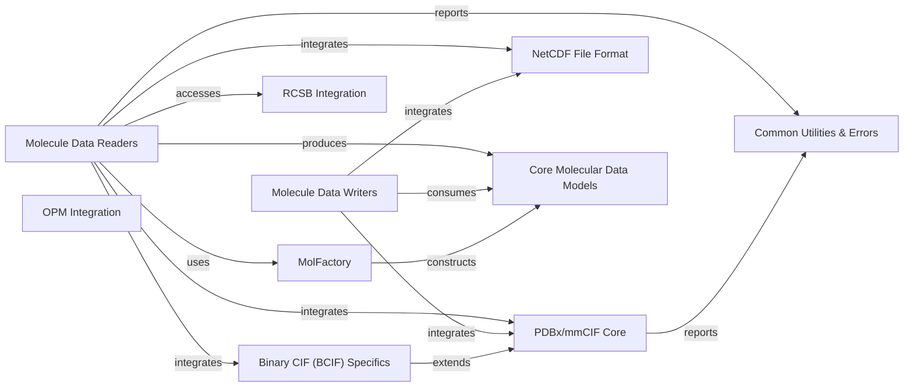

## Component Details

The `Data Management & I/O` subsystem in `moleculekit` is responsible for handling the reading and writing of molecular data in various file formats and interacting with external molecular databases. Its main purpose is to provide a robust and flexible interface for users to load and save molecular structures and trajectories, as well as to fetch data from public repositories like RCSB and OPM. The core flow involves parsing input files or fetching data from external sources, constructing `Molecule` objects (which encapsulate topology and trajectory information), and then allowing these `Molecule` objects to be written back to different file formats. The subsystem ensures data consistency and proper formatting throughout these operations.

### Molecule Data Readers

This component is responsible for parsing various molecular file formats (PDB, XYZ, MOL2, CIF, NetCDF, etc.) and constructing Molecule objects, which typically involve Topology and Trajectory data. It heavily relies on MolFactory for the actual construction process.

**Related Classes/Methods**:

- <a href="https://github.com/Acellera/moleculekit/blob/master/moleculekit/readers.py#L196-L232" target="_blank" rel="noopener noreferrer">`moleculekit.readers.MolFactory.construct` (196:232)</a>

- <a href="https://github.com/Acellera/moleculekit/blob/master/moleculekit/readers.py#L235-L269" target="_blank" rel="noopener noreferrer">`moleculekit.readers.MolFactory._getNumAtoms` (235:269)</a>

- <a href="https://github.com/Acellera/moleculekit/blob/master/moleculekit/readers.py#L311-L376" target="_blank" rel="noopener noreferrer">`moleculekit.readers.MolFactory._parseTopology` (311:376)</a>

- <a href="https://github.com/Acellera/moleculekit/blob/master/moleculekit/readers.py#L379-L450" target="_blank" rel="noopener noreferrer">`moleculekit.readers.MolFactory._parseTraj` (379:450)</a>

- <a href="https://github.com/Acellera/moleculekit/blob/master/moleculekit/readers.py#L272-L308" target="_blank" rel="noopener noreferrer">`moleculekit.readers.MolFactory._elementChecks` (272:308)</a>

### Molecule Data Writers

This component handles writing molecular data to various file formats (PDB, PDBQT, XTC, MOL2, TRR, NetCDF, CIF, BCIF, MMTF). It ensures data is correctly formatted and structured for output.

**Related Classes/Methods**:

- <a href="https://github.com/Acellera/moleculekit/blob/master/moleculekit/molecule.py#L1699-L1734" target="_blank" rel="noopener noreferrer">`moleculekit.molecule.Molecule.write` (1699:1734)</a>

### PDBx/mmCIF Core

This component provides the fundamental data structures and parsing/writing logic for PDBx/mmCIF formatted data. This includes the generic PDBx reader/writer and the container classes.

**Related Classes/Methods**:

- <a href="https://github.com/Acellera/moleculekit/blob/master/moleculekit/pdbx/reader/PdbxReader.py#L51-L478" target="_blank" rel="noopener noreferrer">`moleculekit.pdbx.reader.PdbxReader.PdbxReader` (51:478)</a>

- <a href="https://github.com/Acellera/moleculekit/blob/master/moleculekit/pdbx/writer/PdbxWriter.py#L29-L194" target="_blank" rel="noopener noreferrer">`moleculekit.pdbx.writer.PdbxWriter.PdbxWriter` (29:194)</a>

- <a href="https://github.com/Acellera/moleculekit/blob/master/moleculekit/pdbx/reader/PdbxContainers.py#L77-L168" target="_blank" rel="noopener noreferrer">`moleculekit.pdbx.reader.PdbxContainers.ContainerBase` (77:168)</a>

- <a href="https://github.com/Acellera/moleculekit/blob/master/moleculekit/pdbx/reader/PdbxContainers.py#L207-L223" target="_blank" rel="noopener noreferrer">`moleculekit.pdbx.reader.PdbxContainers.DataContainer` (207:223)</a>

- <a href="https://github.com/Acellera/moleculekit/blob/master/moleculekit/pdbx/reader/PdbxContainers.py#L271-L863" target="_blank" rel="noopener noreferrer">`moleculekit.pdbx.reader.PdbxContainers.DataCategory` (271:863)</a>

### Binary CIF (BCIF) Specifics

This component specializes in deserializing binary CIF (BCIF) data. It includes decoders for various data types and handles the conversion of binary streams into structured data containers.

**Related Classes/Methods**:

- <a href="https://github.com/Acellera/moleculekit/blob/master/moleculekit/pdbx/reader/BinaryCifReader.py#L31-L219" target="_blank" rel="noopener noreferrer">`moleculekit.pdbx.reader.BinaryCifReader.BinaryCifReader` (31:219)</a>

- <a href="https://github.com/Acellera/moleculekit/blob/master/moleculekit/pdbx/reader/BinaryCifReader.py#L44-L86" target="_blank" rel="noopener noreferrer">`moleculekit.pdbx.reader.BinaryCifReader.BinaryCifReader.deserialize` (44:86)</a>

- <a href="https://github.com/Acellera/moleculekit/blob/master/moleculekit/pdbx/reader/BinaryCifReader.py#L88-L165" target="_blank" rel="noopener noreferrer">`moleculekit.pdbx.reader.BinaryCifReader.BinaryCifReader.__deserialize` (88:165)</a>

### NetCDF File Format

This component provides functionalities for reading and writing NetCDF files, including handling dimensions, attributes, and variables. It manages the low-level packing and unpacking of data for NetCDF format.

**Related Classes/Methods**: _None_

### RCSB Integration

This component provides utilities to fetch and process data from the RCSB Protein Data Bank.

**Related Classes/Methods**: _None_

### OPM Integration

This component offers functionalities for interacting with the OPM database.

**Related Classes/Methods**: _None_

### Core Molecular Data Models

This component represents the fundamental data structures for molecular information, specifically the `Molecule` object, which encapsulates `Topology` and `Trajectory` data, used across various reading and writing operations.

**Related Classes/Methods**:

- <a href="https://github.com/Acellera/moleculekit/blob/master/moleculekit/molecule.py#L192-L2963" target="_blank" rel="noopener noreferrer">`moleculekit.molecule.Molecule` (192:2963)</a>

### MolFactory

MolFactory is a central factory component responsible for constructing complete molecule objects from parsed topology and trajectory data. It ensures consistency and proper assembly of molecular structures.

**Related Classes/Methods**:

- <a href="https://github.com/Acellera/moleculekit/blob/master/moleculekit/readers.py#L196-L232" target="_blank" rel="noopener noreferrer">`moleculekit.readers.MolFactory.construct` (196:232)</a>

- <a href="https://github.com/Acellera/moleculekit/blob/master/moleculekit/readers.py#L235-L269" target="_blank" rel="noopener noreferrer">`moleculekit.readers.MolFactory._getNumAtoms` (235:269)</a>

- <a href="https://github.com/Acellera/moleculekit/blob/master/moleculekit/readers.py#L311-L376" target="_blank" rel="noopener noreferrer">`moleculekit.readers.MolFactory._parseTopology` (311:376)</a>

- <a href="https://github.com/Acellera/moleculekit/blob/master/moleculekit/readers.py#L379-L450" target="_blank" rel="noopener noreferrer">`moleculekit.readers.MolFactory._parseTraj` (379:450)</a>

### Common Utilities & Errors

This component encapsulates various error types that can occur during file parsing and data processing, providing specific exceptions for different failure scenarios. It also includes general utility functions used across the subsystem.

**Related Classes/Methods**: _None_

### [FAQ](https://github.com/CodeBoarding/GeneratedOnBoardings/tree/main?tab=readme-ov-file#faq)