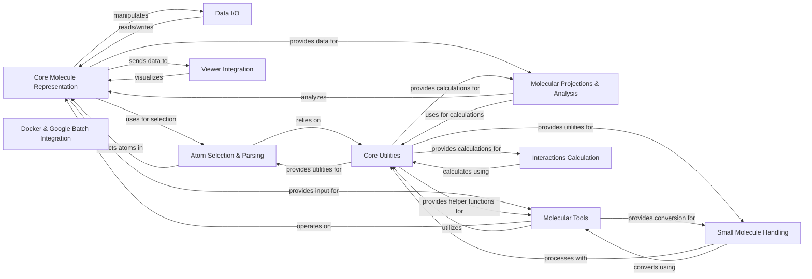

## Component Details

This architecture outlines the `moleculekit` library, designed for molecular data manipulation, analysis, and visualization. It centers around a `Core Molecule Representation` that holds fundamental molecular data, supported by `Data I/O` for file handling. `Atom Selection & Parsing` provides a powerful query language for selecting specific atoms, while `Core Utilities` offers a broad range of general-purpose functions, including mathematical operations and file system tools. `Molecular Projections & Analysis` enables the calculation of various molecular properties, and `Molecular Tools` provides specialized functionalities like docking and system preparation. `Viewer Integration` facilitates external visualization, `Interactions Calculation` identifies molecular interactions, `Small Molecule Handling` manages small molecule data, and `Docker & Google Batch Integration` supports scalable task execution.

### Core Molecule Representation

Manages the fundamental molecular data structure, including atomic coordinates, topology, and trajectory. Provides methods for manipulating molecules, such as adding/removing atoms, transforming coordinates, and calculating properties.

**Related Classes/Methods**:

- <a href="https://github.com/Acellera/moleculekit/blob/master/moleculekit/molecule.py#L192-L2963" target="_blank" rel="noopener noreferrer">`moleculekit.molecule.Molecule` (192:2963)</a>

- <a href="https://github.com/Acellera/moleculekit/blob/master/moleculekit/molecule.py#L149-L189" target="_blank" rel="noopener noreferrer">`moleculekit.molecule._atoms_to_sequence` (149:189)</a>

- <a href="https://github.com/Acellera/moleculekit/blob/master/moleculekit/molecule.py#L2966-L3061" target="_blank" rel="noopener noreferrer">`moleculekit.molecule.UniqueAtomID` (2966:3061)</a>

- <a href="https://github.com/Acellera/moleculekit/blob/master/moleculekit/molecule.py#L3064-L3158" target="_blank" rel="noopener noreferrer">`moleculekit.molecule.UniqueResidueID` (3064:3158)</a>

- <a href="https://github.com/Acellera/moleculekit/blob/master/moleculekit/molecule.py#L3280-L3288" target="_blank" rel="noopener noreferrer">`moleculekit.molecule._getResidueIndexesByAtom` (3280:3288)</a>

### Data I/O

Handles the reading and writing of molecular data from/to various file formats (e.g., PDB, PRMTOP, PSF, XTC, CIF, MMTF). It provides factory methods to construct Molecule objects from input files and functions to serialize Molecule objects to output files.

**Related Classes/Methods**:

- <a href="https://github.com/Acellera/moleculekit/blob/master/moleculekit/readers.py#L192-L475" target="_blank" rel="noopener noreferrer">`moleculekit.readers.MolFactory` (192:475)</a>

- <a href="https://github.com/Acellera/moleculekit/blob/master/moleculekit/readers.py#L908-L1292" target="_blank" rel="noopener noreferrer">`moleculekit.readers.PDBread` (908:1292)</a>

- <a href="https://github.com/Acellera/moleculekit/blob/master/moleculekit/readers.py#L1299-L1458" target="_blank" rel="noopener noreferrer">`moleculekit.readers.PRMTOPread` (1299:1458)</a>

- <a href="https://github.com/Acellera/moleculekit/blob/master/moleculekit/readers.py#L1461-L1541" target="_blank" rel="noopener noreferrer">`moleculekit.readers.PSFread` (1461:1541)</a>

- <a href="https://github.com/Acellera/moleculekit/blob/master/moleculekit/readers.py#L1544-L1580" target="_blank" rel="noopener noreferrer">`moleculekit.readers.XTCread` (1544:1580)</a>

- <a href="https://github.com/Acellera/moleculekit/blob/master/moleculekit/readers.py#L1583-L1614" target="_blank" rel="noopener noreferrer">`moleculekit.readers.XSCread` (1583:1614)</a>

- <a href="https://github.com/Acellera/moleculekit/blob/master/moleculekit/readers.py#L2863-L2961" target="_blank" rel="noopener noreferrer">`moleculekit.readers.NETCDFread` (2863:2961)</a>

- <a href="https://github.com/Acellera/moleculekit/blob/master/moleculekit/readers.py#L3005-L3046" target="_blank" rel="noopener noreferrer">`moleculekit.readers.TRRread` (3005:3046)</a>

- <a href="https://github.com/Acellera/moleculekit/blob/master/moleculekit/readers.py#L812-L828" target="_blank" rel="noopener noreferrer">`moleculekit.readers._getPDB` (812:828)</a>

- <a href="https://github.com/Acellera/moleculekit/blob/master/moleculekit/writers.py#L152-L267" target="_blank" rel="noopener noreferrer">`moleculekit.writers.PDBwrite` (152:267)</a>

- <a href="https://github.com/Acellera/moleculekit/blob/master/moleculekit/writers.py#L985-L1038" target="_blank" rel="noopener noreferrer">`moleculekit.writers.MDTRAJwrite` (985:1038)</a>

- <a href="https://github.com/Acellera/moleculekit/blob/master/moleculekit/writers.py#L1041-L1251" target="_blank" rel="noopener noreferrer">`moleculekit.writers.CIFwrite` (1041:1251)</a>

- <a href="https://github.com/Acellera/moleculekit/blob/master/moleculekit/writers.py#L1305-L1453" target="_blank" rel="noopener noreferrer">`moleculekit.writers.MMTFwrite` (1305:1453)</a>

### Molecular Projections & Analysis

Provides a framework for calculating various molecular properties and projections, such as RMSD, SASA, dihedrals, and distances. These projections are often used for analyzing molecular dynamics simulations.

**Related Classes/Methods**:

- <a href="https://github.com/Acellera/moleculekit/blob/master/moleculekit/projections/metricfluctuation.py#L16-L191" target="_blank" rel="noopener noreferrer">`moleculekit.projections.metricfluctuation.MetricFluctuation` (16:191)</a>

- <a href="https://github.com/Acellera/moleculekit/blob/master/moleculekit/projections/metricsasa.py#L12-L195" target="_blank" rel="noopener noreferrer">`moleculekit.projections.metricsasa.MetricSasa` (12:195)</a>

- <a href="https://github.com/Acellera/moleculekit/blob/master/moleculekit/projections/metricdihedral.py#L16-L725" target="_blank" rel="noopener noreferrer">`moleculekit.projections.metricdihedral.Dihedral` (16:725)</a>

- <a href="https://github.com/Acellera/moleculekit/blob/master/moleculekit/projections/metricdihedral.py#L728-L854" target="_blank" rel="noopener noreferrer">`moleculekit.projections.metricdihedral.MetricDihedral` (728:854)</a>

- <a href="https://github.com/Acellera/moleculekit/blob/master/moleculekit/projections/metricdistance.py#L14-L313" target="_blank" rel="noopener noreferrer">`moleculekit.projections.metricdistance.MetricDistance` (14:313)</a>

- <a href="https://github.com/Acellera/moleculekit/blob/master/moleculekit/projections/metricdistance.py#L316-L361" target="_blank" rel="noopener noreferrer">`moleculekit.projections.metricdistance.MetricSelfDistance` (316:361)</a>

- <a href="https://github.com/Acellera/moleculekit/blob/master/moleculekit/projections/metricdistance.py#L364-L393" target="_blank" rel="noopener noreferrer">`moleculekit.projections.metricdistance.contactVecToMatrix` (364:393)</a>

- <a href="https://github.com/Acellera/moleculekit/blob/master/moleculekit/projections/metricdistance.py#L396-L524" target="_blank" rel="noopener noreferrer">`moleculekit.projections.metricdistance.reconstructContactMap` (396:524)</a>

- <a href="https://github.com/Acellera/moleculekit/blob/master/moleculekit/projections/metricshell.py#L12-L175" target="_blank" rel="noopener noreferrer">`moleculekit.projections.metricshell.MetricShell` (12:175)</a>

- <a href="https://github.com/Acellera/moleculekit/blob/master/moleculekit/projections/metricsecondarystructure.py#L13-L200" target="_blank" rel="noopener noreferrer">`moleculekit.projections.metricsecondarystructure.MetricSecondaryStructure` (13:200)</a>

- <a href="https://github.com/Acellera/moleculekit/blob/master/moleculekit/projections/metricrmsd.py#L12-L150" target="_blank" rel="noopener noreferrer">`moleculekit.projections.metricrmsd.MetricRmsd` (12:150)</a>

- <a href="https://github.com/Acellera/moleculekit/blob/master/moleculekit/projections/metricplumed2.py#L412-L585" target="_blank" rel="noopener noreferrer">`moleculekit.projections.metricplumed2.MetricPlumed2` (412:585)</a>

### Molecular Tools

Offers a collection of specialized tools for various molecular operations, including docking, atom typing, graph alignment, molecule checks, auto-segmentation, homology modeling, voxel descriptor generation, and system preparation.

**Related Classes/Methods**:

- <a href="https://github.com/Acellera/moleculekit/blob/master/moleculekit/tools/docking.py#L31-L224" target="_blank" rel="noopener noreferrer">`moleculekit.tools.docking.dock` (31:224)</a>

- <a href="https://github.com/Acellera/moleculekit/blob/master/moleculekit/tools/atomtyper.py#L98-L204" target="_blank" rel="noopener noreferrer">`moleculekit.tools.atomtyper.prepareProteinForAtomtyping` (98:204)</a>

- <a href="https://github.com/Acellera/moleculekit/blob/master/moleculekit/tools/graphalignment.py#L48-L75" target="_blank" rel="noopener noreferrer">`moleculekit.tools.graphalignment.compareGraphs` (48:75)</a>

- <a href="https://github.com/Acellera/moleculekit/blob/master/moleculekit/tools/graphalignment.py#L78-L97" target="_blank" rel="noopener noreferrer">`moleculekit.tools.graphalignment.makeMolGraph` (78:97)</a>

- <a href="https://github.com/Acellera/moleculekit/blob/master/moleculekit/tools/moleculechecks.py#L36-L51" target="_blank" rel="noopener noreferrer">`moleculekit.tools.moleculechecks.isLigandOptimized` (36:51)</a>

- <a href="https://github.com/Acellera/moleculekit/blob/master/moleculekit/tools/autosegment.py#L17-L130" target="_blank" rel="noopener noreferrer">`moleculekit.tools.autosegment.autoSegment` (17:130)</a>

- <a href="https://github.com/Acellera/moleculekit/blob/master/moleculekit/tools/modelling.py#L51-L152" target="_blank" rel="noopener noreferrer">`moleculekit.tools.modelling.model_gaps` (51:152)</a>

- <a href="https://github.com/Acellera/moleculekit/blob/master/moleculekit/tools/voxeldescriptors.py#L62-L78" target="_blank" rel="noopener noreferrer">`moleculekit.tools.voxeldescriptors.rotateCoordinates` (62:78)</a>

- <a href="https://github.com/Acellera/moleculekit/blob/master/moleculekit/tools/voxeldescriptors.py#L128-L166" target="_blank" rel="noopener noreferrer">`moleculekit.tools.voxeldescriptors.getCenters` (128:166)</a>

- <a href="https://github.com/Acellera/moleculekit/blob/master/moleculekit/tools/preparation.py#L31-L82" target="_blank" rel="noopener noreferrer">`moleculekit.tools.preparation._check_chain_and_segid` (31:82)</a>

- <a href="https://github.com/Acellera/moleculekit/blob/master/moleculekit/tools/preparation.py#L489-L505" target="_blank" rel="noopener noreferrer">`moleculekit.tools.preparation._fix_protonation_resnames` (489:505)</a>

- <a href="https://github.com/Acellera/moleculekit/blob/master/moleculekit/tools/preparation.py#L531-L815" target="_blank" rel="noopener noreferrer">`moleculekit.tools.preparation.systemPrepare` (531:815)</a>

- `moleculekit.tools.obabel_tools.getOpenBabelProperties` (full file reference)

- `moleculekit.tools.obabel_tools.openbabelConvert` (full file reference)

### Atom Selection & Parsing

Provides a flexible mechanism for selecting atoms within a Molecule object using a domain-specific language. It leverages the PLY library for parsing the selection expressions and analyzing molecular properties to facilitate complex selections.

**Related Classes/Methods**:

- <a href="https://github.com/Acellera/moleculekit/blob/master/moleculekit/atomselect/analyze.py#L66-L135" target="_blank" rel="noopener noreferrer">`moleculekit.atomselect.analyze.analyze` (66:135)</a>

- <a href="https://github.com/Acellera/moleculekit/blob/master/moleculekit/atomselect/atomselect.py#L44-L266" target="_blank" rel="noopener noreferrer">`moleculekit.atomselect.atomselect.traverse_ast` (44:266)</a>

- <a href="https://github.com/Acellera/moleculekit/blob/master/moleculekit/atomselect/atomselect.py#L269-L286" target="_blank" rel="noopener noreferrer">`moleculekit.atomselect.atomselect.atomselect` (269:286)</a>

- <a href="https://github.com/Acellera/moleculekit/blob/master/moleculekit/ply/lex.py#L790-L942" target="_blank" rel="noopener noreferrer">`moleculekit.ply.lex` (790:942)</a>

- <a href="https://github.com/Acellera/moleculekit/blob/master/moleculekit/ply/yacc.py#L2429-L2674" target="_blank" rel="noopener noreferrer">`moleculekit.ply.yacc` (2429:2674)</a>

### Core Utilities

Contains a wide range of general-purpose utility functions that support various operations across the moleculekit library, including list manipulation, temporary file handling, sequence identification, mathematical operations (e.g., rotations, distances, angles, dihedrals), file system utilities, and unit cell transformations.

**Related Classes/Methods**:

- <a href="https://github.com/Acellera/moleculekit/blob/master/moleculekit/util.py#L23-L39" target="_blank" rel="noopener noreferrer">`moleculekit.util.ensurelist` (23:39)</a>

- <a href="https://github.com/Acellera/moleculekit/blob/master/moleculekit/util.py#L14-L20" target="_blank" rel="noopener noreferrer">`moleculekit.util.tempname` (14:20)</a>

- <a href="https://github.com/Acellera/moleculekit/blob/master/moleculekit/util.py#L152-L211" target="_blank" rel="noopener noreferrer">`moleculekit.util.sequenceID` (152:211)</a>

- <a href="https://github.com/Acellera/moleculekit/blob/master/moleculekit/util.py#L616-L628" target="_blank" rel="noopener noreferrer">`moleculekit.util.find_executable` (616:628)</a>

- <a href="https://github.com/Acellera/moleculekit/blob/master/moleculekit/util.py#L42-L89" target="_blank" rel="noopener noreferrer">`moleculekit.util.rotationMatrix` (42:89)</a>

- <a href="https://github.com/Acellera/moleculekit/blob/master/moleculekit/util.py#L295-L320" target="_blank" rel="noopener noreferrer">`moleculekit.util.boundingBox` (295:320)</a>

- <a href="https://github.com/Acellera/moleculekit/blob/master/moleculekit/util.py#L534-L541" target="_blank" rel="noopener noreferrer">`moleculekit.util.guessAnglesAndDihedrals` (534:541)</a>

- <a href="https://github.com/Acellera/moleculekit/blob/master/moleculekit/util.py#L670-L676" target="_blank" rel="noopener noreferrer">`moleculekit.util.string_to_tempfile` (670:676)</a>

- <a href="https://github.com/Acellera/moleculekit/blob/master/moleculekit/util.py#L659-L667" target="_blank" rel="noopener noreferrer">`moleculekit.util.check_port` (659:667)</a>

- <a href="https://github.com/Acellera/moleculekit/blob/master/moleculekit/util.py#L631-L656" target="_blank" rel="noopener noreferrer">`moleculekit.util.wait_for_port` (631:656)</a>

- <a href="https://github.com/Acellera/moleculekit/blob/master/moleculekit/util.py#L568-L576" target="_blank" rel="noopener noreferrer">`moleculekit.util.natsorted` (568:576)</a>

- <a href="https://github.com/Acellera/moleculekit/blob/master/moleculekit/util.py#L348-L351" target="_blank" rel="noopener noreferrer">`moleculekit.util.writeVoxels` (348:351)</a>

- <a href="https://github.com/Acellera/moleculekit/blob/master/moleculekit/util.py#L406-L442" target="_blank" rel="noopener noreferrer">`moleculekit.util.readCube` (406:442)</a>

- <a href="https://github.com/Acellera/moleculekit/blob/master/moleculekit/util.py#L445-L471" target="_blank" rel="noopener noreferrer">`moleculekit.util._get_pdb_entities` (445:471)</a>

- <a href="https://github.com/Acellera/moleculekit/blob/master/moleculekit/util.py#L474-L506" target="_blank" rel="noopener noreferrer">`moleculekit.util._get_pdb_entity_sequences` (474:506)</a>

- <a href="https://github.com/Acellera/moleculekit/blob/master/moleculekit/util.py#L509-L531" target="_blank" rel="noopener noreferrer">`moleculekit.util.calculateAnglesAndDihedrals` (509:531)</a>

- <a href="https://github.com/Acellera/moleculekit/blob/master/moleculekit/util.py#L595-L613" target="_blank" rel="noopener noreferrer">`moleculekit.util.folder_diff` (595:613)</a>

- <a href="https://github.com/Acellera/moleculekit/blob/master/moleculekit/util.py#L579-L592" target="_blank" rel="noopener noreferrer">`moleculekit.util.file_diff` (579:592)</a>

- <a href="https://github.com/Acellera/moleculekit/blob/master/moleculekit/util.py#L679-L687" target="_blank" rel="noopener noreferrer">`moleculekit.util.opm` (679:687)</a>

- <a href="https://github.com/Acellera/moleculekit/blob/master/moleculekit/distance.py#L1-L17" target="_blank" rel="noopener noreferrer">`moleculekit.distance.cdist` (1:17)</a>

- <a href="https://github.com/Acellera/moleculekit/blob/master/moleculekit/distance.py#L34-L38" target="_blank" rel="noopener noreferrer">`moleculekit.distance.squareform` (34:38)</a>

- <a href="https://github.com/Acellera/moleculekit/blob/master/moleculekit/distance.py#L20-L31" target="_blank" rel="noopener noreferrer">`moleculekit.distance.pdist` (20:31)</a>

- <a href="https://github.com/Acellera/moleculekit/blob/master/moleculekit/distance.py#L41-L95" target="_blank" rel="noopener noreferrer">`moleculekit.distance.calculate_contacts` (41:95)</a>

- <a href="https://github.com/Acellera/moleculekit/blob/master/moleculekit/dihedral.py#L18-L53" target="_blank" rel="noopener noreferrer">`moleculekit.dihedral.dihedralAngle` (18:53)</a>

- <a href="https://github.com/Acellera/moleculekit/blob/master/moleculekit/dihedral.py#L8-L15" target="_blank" rel="noopener noreferrer">`moleculekit.dihedral._wrapBondedDistance` (8:15)</a>

- <a href="https://github.com/Acellera/moleculekit/blob/master/moleculekit/unitcell.py#L119-L210" target="_blank" rel="noopener noreferrer">`moleculekit.unitcell.box_vectors_to_lengths_and_angles` (119:210)</a>

- <a href="https://github.com/Acellera/moleculekit/blob/master/moleculekit/unitcell.py#L32-L116" target="_blank" rel="noopener noreferrer">`moleculekit.unitcell.lengths_and_angles_to_box_vectors` (32:116)</a>

### Viewer Integration

Facilitates the visualization of molecular structures and trajectories using external molecular viewers like VMD, PyMOL, and NGL. It provides methods to send molecular data to these viewers and control their display.

**Related Classes/Methods**:

- <a href="https://github.com/Acellera/moleculekit/blob/master/moleculekit/vmdviewer.py#L33-L298" target="_blank" rel="noopener noreferrer">`moleculekit.vmdviewer.VMD` (33:298)</a>

- <a href="https://github.com/Acellera/moleculekit/blob/master/moleculekit/viewer.py#L31-L44" target="_blank" rel="noopener noreferrer">`moleculekit.viewer._pymol_view` (31:44)</a>

- <a href="https://github.com/Acellera/moleculekit/blob/master/moleculekit/viewer.py#L53-L65" target="_blank" rel="noopener noreferrer">`moleculekit.viewer._launch_pmview_exe` (53:65)</a>

- <a href="https://github.com/Acellera/moleculekit/blob/master/moleculekit/viewer.py#L68-L73" target="_blank" rel="noopener noreferrer">`moleculekit.viewer._pmview_launch` (68:73)</a>

- <a href="https://github.com/Acellera/moleculekit/blob/master/moleculekit/viewer.py#L76-L107" target="_blank" rel="noopener noreferrer">`moleculekit.viewer._pmview_view` (76:107)</a>

- <a href="https://github.com/Acellera/moleculekit/blob/master/moleculekit/viewer.py#L110-L124" target="_blank" rel="noopener noreferrer">`moleculekit.viewer._pmview_get_mols` (110:124)</a>

- <a href="https://github.com/Acellera/moleculekit/blob/master/moleculekit/vmdgraphics.py#L268-L320" target="_blank" rel="noopener noreferrer">`moleculekit.vmdgraphics.VMDIsosurface` (268:320)</a>

### Interactions Calculation

Provides functionalities to calculate different types of molecular interactions, such as salt bridges, hydrophobic interactions, and metal coordinations, which are crucial for understanding molecular recognition and binding.

**Related Classes/Methods**:

- <a href="https://github.com/Acellera/moleculekit/blob/master/moleculekit/interactions/interactions.py#L30-L67" target="_blank" rel="noopener noreferrer">`moleculekit.interactions.interactions.offset_ligand_props` (30:67)</a>

- <a href="https://github.com/Acellera/moleculekit/blob/master/moleculekit/interactions/interactions.py#L572-L597" target="_blank" rel="noopener noreferrer">`moleculekit.interactions.interactions.saltbridge_calculate` (572:597)</a>

- <a href="https://github.com/Acellera/moleculekit/blob/master/moleculekit/interactions/interactions.py#L682-L694" target="_blank" rel="noopener noreferrer">`moleculekit.interactions.interactions.hydrophobic_calculate` (682:694)</a>

- <a href="https://github.com/Acellera/moleculekit/blob/master/moleculekit/interactions/interactions.py#L697-L797" target="_blank" rel="noopener noreferrer">`moleculekit.interactions.interactions.metal_coordination_calculate` (697:797)</a>

### Small Molecule Handling

Dedicated to handling small molecules, including reading SDF files and retrieving ligand information from RCSB.

**Related Classes/Methods**:

- <a href="https://github.com/Acellera/moleculekit/blob/master/moleculekit/smallmol/smallmollib.py#L91-L120" target="_blank" rel="noopener noreferrer">`moleculekit.smallmol.smallmollib.sdfReader` (91:120)</a>

- <a href="https://github.com/Acellera/moleculekit/blob/master/moleculekit/smallmol/util.py#L27-L76" target="_blank" rel="noopener noreferrer">`moleculekit.smallmol.util.getRCSBLigandByLigname` (27:76)</a>

- <a href="https://github.com/Acellera/moleculekit/blob/master/moleculekit/smallmol/smallmol.py#L50-L1223" target="_blank" rel="noopener noreferrer">`moleculekit.smallmol.smallmol.SmallMol` (50:1223)</a>

### Docker & Google Batch Integration

Manages the execution of molecular tasks using Google Batch, providing functionalities to wait for job completion and retrieve status.

**Related Classes/Methods**:

- <a href="https://github.com/Acellera/moleculekit/blob/master/docker/google_batch/googlebatchwrapper.py#L269-L451" target="_blank" rel="noopener noreferrer">`moleculekit.docker.google_batch.googlebatchwrapper.GoogleBatchJob` (269:451)</a>

### [FAQ](https://github.com/CodeBoarding/GeneratedOnBoardings/tree/main?tab=readme-ov-file#faq)