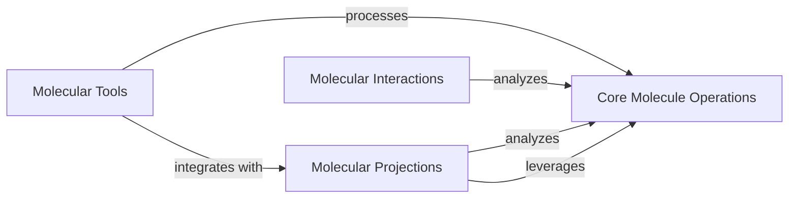

## Component Details

This subsystem provides a comprehensive suite of functionalities for molecular analysis and simulation preparation. It encompasses core operations for manipulating molecular structures, a diverse set of tools for system preparation and advanced analysis, methods for calculating various molecular projections, and specialized functions for identifying and quantifying molecular interactions. The system's primary purpose is to facilitate the setup of molecular simulations and the in-depth analysis of molecular properties and dynamics.

### Core Molecule Operations

This component encapsulates fundamental operations on Molecule objects, including basic manipulation and alignment. It provides core functionalities for structural alignment and sequence-based alignment of molecular structures.

**Related Classes/Methods**:

- <a href="https://github.com/Acellera/moleculekit/blob/master/moleculekit/molecule.py#L760-L860" target="_blank" rel="noopener noreferrer">`moleculekit.molecule.Molecule.align` (760:860)</a>

- <a href="https://github.com/Acellera/moleculekit/blob/master/moleculekit/align.py#L70-L192" target="_blank" rel="noopener noreferrer">`moleculekit.align.molTMalign` (70:192)</a>

- <a href="https://github.com/Acellera/moleculekit/blob/master/moleculekit/opm.py#L169-L252" target="_blank" rel="noopener noreferrer">`moleculekit.opm.align_to_opm` (169:252)</a>

### Molecular Tools

This comprehensive component provides a wide array of utilities for molecular system preparation, analysis, and manipulation. It covers functionalities such as crystal packing, docking, custom residue handling, atom typing, graph-based analysis, molecule validity checks, detection of molecular features, and voxel descriptor generation.

**Related Classes/Methods**:

- <a href="https://github.com/Acellera/moleculekit/blob/master/moleculekit/tools/preparation.py#L531-L815" target="_blank" rel="noopener noreferrer">`moleculekit.tools.preparation.systemPrepare` (531:815)</a>

- <a href="https://github.com/Acellera/moleculekit/blob/master/moleculekit/tools/docking.py#L31-L224" target="_blank" rel="noopener noreferrer">`moleculekit.tools.docking.dock` (31:224)</a>

- <a href="https://github.com/Acellera/moleculekit/blob/master/moleculekit/tools/atomtyper.py#L268-L285" target="_blank" rel="noopener noreferrer">`moleculekit.tools.atomtyper.getPDBQTAtomTypesAndCharges` (268:285)</a>

- <a href="https://github.com/Acellera/moleculekit/blob/master/moleculekit/tools/moleculechecks.py#L8-L21" target="_blank" rel="noopener noreferrer">`moleculekit.tools.moleculechecks.closestDistance` (8:21)</a>

- <a href="https://github.com/Acellera/moleculekit/blob/master/moleculekit/tools/voxeldescriptors.py#L169-L281" target="_blank" rel="noopener noreferrer">`moleculekit.tools.voxeldescriptors.getVoxelDescriptors` (169:281)</a>

### Molecular Projections

This component is responsible for calculating and managing various molecular projections, which are used to analyze molecular trajectories and properties. It includes metrics for fluctuations, surface accessibility, dihedral angles, distances, RMSD, and integration with external tools like PLUMED2.

**Related Classes/Methods**:

- <a href="https://github.com/Acellera/moleculekit/blob/master/moleculekit/projections/projection.py#L8-L48" target="_blank" rel="noopener noreferrer">`moleculekit.projections.projection.Projection` (8:48)</a>

- <a href="https://github.com/Acellera/moleculekit/blob/master/moleculekit/projections/metricrmsd.py#L12-L150" target="_blank" rel="noopener noreferrer">`moleculekit.projections.metricrmsd.MetricRmsd` (12:150)</a>

- <a href="https://github.com/Acellera/moleculekit/blob/master/moleculekit/projections/metricsasa.py#L12-L195" target="_blank" rel="noopener noreferrer">`moleculekit.projections.metricsasa.MetricSasa` (12:195)</a>

### Molecular Interactions

This component is dedicated to the identification and quantification of various non-covalent interactions within molecular systems, such as hydrogen bonds, salt bridges, hydrophobic contacts, and metal coordinations. It provides functions to extract relevant properties of ligands and receptors for interaction analysis.

**Related Classes/Methods**:

- <a href="https://github.com/Acellera/moleculekit/blob/master/moleculekit/interactions/interactions.py#L682-L694" target="_blank" rel="noopener noreferrer">`moleculekit.interactions.interactions.hydrophobic_calculate` (682:694)</a>

- <a href="https://github.com/Acellera/moleculekit/blob/master/moleculekit/interactions/interactions.py#L572-L597" target="_blank" rel="noopener noreferrer">`moleculekit.interactions.interactions.saltbridge_calculate` (572:597)</a>

- <a href="https://github.com/Acellera/moleculekit/blob/master/moleculekit/interactions/interactions.py#L205-L226" target="_blank" rel="noopener noreferrer">`moleculekit.interactions.interactions.view_hbonds` (205:226)</a>

### [FAQ](https://github.com/CodeBoarding/GeneratedOnBoardings/tree/main?tab=readme-ov-file#faq)