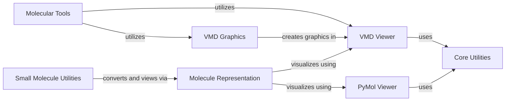

## Component Details

This subsystem provides comprehensive functionalities for visualizing molecular structures and trajectories, and managing their graphical representations. It integrates with external molecular viewers like VMD and PyMol, offering a unified interface for displaying molecules, applying various graphical representations, and performing interactive manipulations. The core purpose is to enable users to visually analyze molecular data generated or processed by the MoleculeKit library.

### VMD Viewer

This component manages the interaction with the VMD (Visual Molecular Dynamics) software. It handles launching VMD, sending commands to it, and managing its display and rendering capabilities. It acts as a bridge between the MoleculeKit library and the external VMD application for molecular visualization.

**Related Classes/Methods**:

- <a href="https://github.com/Acellera/moleculekit/blob/master/moleculekit/vmdviewer.py#L43-L75" target="_blank" rel="noopener noreferrer">`moleculekit.vmdviewer.VMD.__init__` (43:75)</a>

- <a href="https://github.com/Acellera/moleculekit/blob/master/moleculekit/vmdviewer.py#L77-L96" target="_blank" rel="noopener noreferrer">`moleculekit.vmdviewer.VMD.send` (77:96)</a>

- <a href="https://github.com/Acellera/moleculekit/blob/master/moleculekit/vmdviewer.py#L121-L157" target="_blank" rel="noopener noreferrer">`moleculekit.vmdviewer.VMD.rep` (121:157)</a>

- <a href="https://github.com/Acellera/moleculekit/blob/master/moleculekit/vmdviewer.py#L172-L260" target="_blank" rel="noopener noreferrer">`moleculekit.vmdviewer.VMD.render` (172:260)</a>

- <a href="https://github.com/Acellera/moleculekit/blob/master/moleculekit/vmdviewer.py#L262-L292" target="_blank" rel="noopener noreferrer">`moleculekit.vmdviewer.VMD.movie_reps` (262:292)</a>

- <a href="https://github.com/Acellera/moleculekit/blob/master/moleculekit/vmdviewer.py#L294-L295" target="_blank" rel="noopener noreferrer">`moleculekit.vmdviewer.VMD.close` (294:295)</a>

- <a href="https://github.com/Acellera/moleculekit/blob/master/moleculekit/vmdviewer.py#L297-L298" target="_blank" rel="noopener noreferrer">`moleculekit.vmdviewer.VMD.__del__` (297:298)</a>

- <a href="https://github.com/Acellera/moleculekit/blob/master/moleculekit/vmdviewer.py#L301-L312" target="_blank" rel="noopener noreferrer">`moleculekit.vmdviewer.getVMDpath` (301:312)</a>

- <a href="https://github.com/Acellera/moleculekit/blob/master/moleculekit/vmdviewer.py#L315-L342" target="_blank" rel="noopener noreferrer">`moleculekit.vmdviewer.getCurrentViewer` (315:342)</a>

- <a href="https://github.com/Acellera/moleculekit/blob/master/moleculekit/vmdviewer.py#L345-L363" target="_blank" rel="noopener noreferrer">`moleculekit.vmdviewer.viewer` (345:363)</a>

### PyMol Viewer

This component provides functionalities for interacting with PyMol, another molecular visualization system. It includes methods for launching PyMol, viewing molecules, and retrieving molecular information from the PyMol instance. It leverages utility functions for port checking and executable finding.

**Related Classes/Methods**:

- <a href="https://github.com/Acellera/moleculekit/blob/master/moleculekit/viewer.py#L31-L44" target="_blank" rel="noopener noreferrer">`moleculekit.viewer._pymol_view` (31:44)</a>

- <a href="https://github.com/Acellera/moleculekit/blob/master/moleculekit/viewer.py#L53-L65" target="_blank" rel="noopener noreferrer">`moleculekit.viewer._launch_pmview_exe` (53:65)</a>

- <a href="https://github.com/Acellera/moleculekit/blob/master/moleculekit/viewer.py#L68-L73" target="_blank" rel="noopener noreferrer">`moleculekit.viewer._pmview_launch` (68:73)</a>

- <a href="https://github.com/Acellera/moleculekit/blob/master/moleculekit/viewer.py#L76-L107" target="_blank" rel="noopener noreferrer">`moleculekit.viewer._pmview_view` (76:107)</a>

- <a href="https://github.com/Acellera/moleculekit/blob/master/moleculekit/viewer.py#L110-L124" target="_blank" rel="noopener noreferrer">`moleculekit.viewer._pmview_get_mols` (110:124)</a>

- <a href="https://github.com/Acellera/moleculekit/blob/master/moleculekit/viewer.py#L127-L128" target="_blank" rel="noopener noreferrer">`moleculekit.viewer.getCurrentPymolViewer` (127:128)</a>

- <a href="https://github.com/Acellera/moleculekit/blob/master/moleculekit/viewer.py#L131-L136" target="_blank" rel="noopener noreferrer">`moleculekit.viewer.getCurrentPMViewer` (131:136)</a>

### VMD Graphics

This component is responsible for creating and managing various graphical objects within the VMD viewer. It provides classes for drawing convex hulls, boxes, spheres, cylinders, text, isosurfaces, and labels, allowing users to visually represent molecular properties and structures.

**Related Classes/Methods**:

- <a href="https://github.com/Acellera/moleculekit/blob/master/moleculekit/vmdgraphics.py#L23-L39" target="_blank" rel="noopener noreferrer">`moleculekit.vmdgraphics.VMDGraphicObject.delete` (23:39)</a>

- <a href="https://github.com/Acellera/moleculekit/blob/master/moleculekit/vmdgraphics.py#L53-L111" target="_blank" rel="noopener noreferrer">`moleculekit.vmdgraphics.VMDConvexHull.__init__` (53:111)</a>

- <a href="https://github.com/Acellera/moleculekit/blob/master/moleculekit/vmdgraphics.py#L115-L179" target="_blank" rel="noopener noreferrer">`moleculekit.vmdgraphics.VMDBox.__init__` (115:179)</a>

- <a href="https://github.com/Acellera/moleculekit/blob/master/moleculekit/vmdgraphics.py#L183-L206" target="_blank" rel="noopener noreferrer">`moleculekit.vmdgraphics.VMDSphere.__init__` (183:206)</a>

- <a href="https://github.com/Acellera/moleculekit/blob/master/moleculekit/vmdgraphics.py#L210-L238" target="_blank" rel="noopener noreferrer">`moleculekit.vmdgraphics.VMDCylinder.__init__` (210:238)</a>

- <a href="https://github.com/Acellera/moleculekit/blob/master/moleculekit/vmdgraphics.py#L242-L265" target="_blank" rel="noopener noreferrer">`moleculekit.vmdgraphics.VMDText.__init__` (242:265)</a>

- <a href="https://github.com/Acellera/moleculekit/blob/master/moleculekit/vmdgraphics.py#L269-L316" target="_blank" rel="noopener noreferrer">`moleculekit.vmdgraphics.VMDIsosurface.__init__` (269:316)</a>

- <a href="https://github.com/Acellera/moleculekit/blob/master/moleculekit/vmdgraphics.py#L318-L320" target="_blank" rel="noopener noreferrer">`moleculekit.vmdgraphics.VMDIsosurface.delete` (318:320)</a>

- <a href="https://github.com/Acellera/moleculekit/blob/master/moleculekit/vmdgraphics.py#L326-L362" target="_blank" rel="noopener noreferrer">`moleculekit.vmdgraphics.VMDLabels.__init__` (326:362)</a>

- <a href="https://github.com/Acellera/moleculekit/blob/master/moleculekit/vmdgraphics.py#L365-L369" target="_blank" rel="noopener noreferrer">`moleculekit.vmdgraphics.VMDLabels.delete` (365:369)</a>

### Molecule Representation

This component handles the representation and visualization of molecular structures. It provides methods to view molecules using different viewers (VMD, NGL, PyMol, PMView) and manages the addition and translation of molecular representations.

**Related Classes/Methods**:

- <a href="https://github.com/Acellera/moleculekit/blob/master/moleculekit/molecule.py#L2278-L2367" target="_blank" rel="noopener noreferrer">`moleculekit.molecule.Molecule.view` (2278:2367)</a>

- <a href="https://github.com/Acellera/moleculekit/blob/master/moleculekit/molecule.py#L2369-L2383" target="_blank" rel="noopener noreferrer">`moleculekit.molecule.Molecule._viewPMView` (2369:2383)</a>

- <a href="https://github.com/Acellera/moleculekit/blob/master/moleculekit/molecule.py#L2385-L2398" target="_blank" rel="noopener noreferrer">`moleculekit.molecule.Molecule._viewPymol` (2385:2398)</a>

- <a href="https://github.com/Acellera/moleculekit/blob/master/moleculekit/molecule.py#L2400-L2424" target="_blank" rel="noopener noreferrer">`moleculekit.molecule.Molecule._viewVMD` (2400:2424)</a>

- <a href="https://github.com/Acellera/moleculekit/blob/master/moleculekit/molecule.py#L2426-L2441" target="_blank" rel="noopener noreferrer">`moleculekit.molecule.Molecule._viewNGL` (2426:2441)</a>

- <a href="https://github.com/Acellera/moleculekit/blob/master/moleculekit/molecule.py#L3409-L3427" target="_blank" rel="noopener noreferrer">`moleculekit.molecule.Representations.add` (3409:3427)</a>

- <a href="https://github.com/Acellera/moleculekit/blob/master/moleculekit/molecule.py#L3452-L3496" target="_blank" rel="noopener noreferrer">`moleculekit.molecule.Representations._translateNGL` (3452:3496)</a>

- <a href="https://github.com/Acellera/moleculekit/blob/master/moleculekit/molecule.py#L3516-L3529" target="_blank" rel="noopener noreferrer">`moleculekit.molecule.Representations._repsNGL` (3516:3529)</a>

### Molecular Tools

This component provides various tools for molecular analysis and manipulation. It includes functionalities for generating crystal packing, viewing voxel features, and visualizing hydrogen bonds, leveraging other MoleculeKit components for core molecular operations and visualization.

**Related Classes/Methods**:

- <a href="https://github.com/Acellera/moleculekit/blob/master/moleculekit/tools/crystalpacking.py#L82-L180" target="_blank" rel="noopener noreferrer">`moleculekit.tools.crystalpacking.generateCrystalPacking` (82:180)</a>

- <a href="https://github.com/Acellera/moleculekit/blob/master/moleculekit/tools/voxeldescriptors.py#L25-L59" target="_blank" rel="noopener noreferrer">`moleculekit.tools.voxeldescriptors.viewVoxelFeatures` (25:59)</a>

- <a href="https://github.com/Acellera/moleculekit/blob/master/moleculekit/interactions/interactions.py#L205-L226" target="_blank" rel="noopener noreferrer">`moleculekit.interactions.interactions.view_hbonds` (205:226)</a>

### Small Molecule Utilities

This component focuses on utilities specific to small molecules. It provides methods for viewing small molecules by converting them into a general Molecule object and then utilizing the Molecule Representation component for visualization.

**Related Classes/Methods**:

- <a href="https://github.com/Acellera/moleculekit/blob/master/moleculekit/smallmol/smallmolcdp.py#L242-L243" target="_blank" rel="noopener noreferrer">`moleculekit.smallmol.smallmolcdp.SmallMolCDP.view` (242:243)</a>

- <a href="https://github.com/Acellera/moleculekit/blob/master/moleculekit/smallmol/smallmolcdp.py#L204-L240" target="_blank" rel="noopener noreferrer">`moleculekit.smallmol.smallmolcdp.SmallMolCDP.toMolecule` (204:240)</a>

- <a href="https://github.com/Acellera/moleculekit/blob/master/moleculekit/smallmol/smallmol.py#L810-L811" target="_blank" rel="noopener noreferrer">`moleculekit.smallmol.smallmol.SmallMol.view` (810:811)</a>

- <a href="https://github.com/Acellera/moleculekit/blob/master/moleculekit/smallmol/smallmol.py#L972-L1017" target="_blank" rel="noopener noreferrer">`moleculekit.smallmol.smallmol.SmallMol.toMolecule` (972:1017)</a>

### Core Utilities

This component encompasses a collection of general utility functions used across various parts of the MoleculeKit library. These utilities include functions for creating temporary files, checking and waiting for network ports, finding executables, and writing voxel data.

**Related Classes/Methods**:

- <a href="https://github.com/Acellera/moleculekit/blob/master/moleculekit/util.py#L670-L676" target="_blank" rel="noopener noreferrer">`moleculekit.util.string_to_tempfile` (670:676)</a>

- <a href="https://github.com/Acellera/moleculekit/blob/master/moleculekit/util.py#L14-L20" target="_blank" rel="noopener noreferrer">`moleculekit.util.tempname` (14:20)</a>

- <a href="https://github.com/Acellera/moleculekit/blob/master/moleculekit/util.py#L659-L667" target="_blank" rel="noopener noreferrer">`moleculekit.util.check_port` (659:667)</a>

- <a href="https://github.com/Acellera/moleculekit/blob/master/moleculekit/util.py#L616-L628" target="_blank" rel="noopener noreferrer">`moleculekit.util.find_executable` (616:628)</a>

- <a href="https://github.com/Acellera/moleculekit/blob/master/moleculekit/util.py#L631-L656" target="_blank" rel="noopener noreferrer">`moleculekit.util.wait_for_port` (631:656)</a>

- <a href="https://github.com/Acellera/moleculekit/blob/master/moleculekit/util.py#L348-L351" target="_blank" rel="noopener noreferrer">`moleculekit.util.writeVoxels` (348:351)</a>

### [FAQ](https://github.com/CodeBoarding/GeneratedOnBoardings/tree/main?tab=readme-ov-file#faq)