```mermaid

graph LR

    Core_Molecular_Data_Model["Core Molecular Data Model"]

    Data_Management_I_O["Data Management & I-O"]

    Molecular_Analysis_Simulation_Preparation["Molecular Analysis & Simulation Preparation"]

    Visualization_User_Interaction["Visualization & User Interaction"]

    Cheminformatics_Cloud_Integration["Cheminformatics & Cloud Integration"]

    Foundational_Utilities_Atom_Selection["Foundational Utilities & Atom Selection"]

    Core_Molecular_Data_Model -- "is managed by" --> Data_Management_I_O

    Core_Molecular_Data_Model -- "is processed by" --> Molecular_Analysis_Simulation_Preparation

    Core_Molecular_Data_Model -- "is visualized by" --> Visualization_User_Interaction

    Core_Molecular_Data_Model -- "is converted by" --> Cheminformatics_Cloud_Integration

    Core_Molecular_Data_Model -- "relies on" --> Foundational_Utilities_Atom_Selection

    Data_Management_I_O -- "creates" --> Core_Molecular_Data_Model

    Data_Management_I_O -- "uses" --> Foundational_Utilities_Atom_Selection

    Molecular_Analysis_Simulation_Preparation -- "operates on" --> Core_Molecular_Data_Model

    Molecular_Analysis_Simulation_Preparation -- "utilizes" --> Foundational_Utilities_Atom_Selection

    Molecular_Analysis_Simulation_Preparation -- "interacts with" --> Cheminformatics_Cloud_Integration

    Visualization_User_Interaction -- "displays" --> Core_Molecular_Data_Model

    Visualization_User_Interaction -- "uses" --> Foundational_Utilities_Atom_Selection

    Cheminformatics_Cloud_Integration -- "converts to/from" --> Core_Molecular_Data_Model

    Cheminformatics_Cloud_Integration -- "supports" --> Molecular_Analysis_Simulation_Preparation

    Cheminformatics_Cloud_Integration -- "uses" --> Foundational_Utilities_Atom_Selection

    Foundational_Utilities_Atom_Selection -- "provides services to" --> Core_Molecular_Data_Model

    Foundational_Utilities_Atom_Selection -- "provides services to" --> Data_Management_I_O

    Foundational_Utilities_Atom_Selection -- "provides services to" --> Molecular_Analysis_Simulation_Preparation

    Foundational_Utilities_Atom_Selection -- "provides services to" --> Visualization_User_Interaction

    Foundational_Utilities_Atom_Selection -- "provides services to" --> Cheminformatics_Cloud_Integration

    click Core_Molecular_Data_Model href "https://github.com/Acellera/moleculekit/blob/main/.codeboarding//Core Molecular Data Model.md" "Details"

    click Data_Management_I_O href "https://github.com/Acellera/moleculekit/blob/main/.codeboarding//Data Management & I-O.md" "Details"

    click Molecular_Analysis_Simulation_Preparation href "https://github.com/Acellera/moleculekit/blob/main/.codeboarding//Molecular Analysis & Simulation Preparation.md" "Details"

    click Visualization_User_Interaction href "https://github.com/Acellera/moleculekit/blob/main/.codeboarding//Visualization & User Interaction.md" "Details"

    click Cheminformatics_Cloud_Integration href "https://github.com/Acellera/moleculekit/blob/main/.codeboarding//Cheminformatics & Cloud Integration.md" "Details"

    click Foundational_Utilities_Atom_Selection href "https://github.com/Acellera/moleculekit/blob/main/.codeboarding//Foundational Utilities & Atom Selection.md" "Details"

```

## Component Details

The `moleculekit` project provides a comprehensive suite of tools for molecular modeling, simulation analysis, and cheminformatics. Its core revolves around a flexible `Molecule` data model, enabling seamless handling of molecular structures and trajectories. The architecture facilitates robust data input/output, advanced molecular analysis, and integration with external visualization and cheminformatics tools, all supported by a strong foundation of utility functions and a powerful atom selection engine.

### Core Molecular Data Model

Defines the central `Molecule` object and its fundamental properties, serving as the primary data structure for molecular systems. It includes basic topological information and utilities for unique atom/residue identification and bond guessing.

**Related Classes/Methods**:

- <a href="https://github.com/Acellera/moleculekit/blob/master/moleculekit/molecule.py#L192-L2963" target="_blank" rel="noopener noreferrer">`moleculekit.molecule.Molecule` (192:2963)</a>

- <a href="https://github.com/Acellera/moleculekit/blob/master/moleculekit/molecule.py#L2966-L3061" target="_blank" rel="noopener noreferrer">`moleculekit.molecule.UniqueAtomID` (2966:3061)</a>

- <a href="https://github.com/Acellera/moleculekit/blob/master/moleculekit/molecule.py#L3064-L3158" target="_blank" rel="noopener noreferrer">`moleculekit.molecule.UniqueResidueID` (3064:3158)</a>

- <a href="https://github.com/Acellera/moleculekit/blob/master/moleculekit/molecule.py#L3385-L3529" target="_blank" rel="noopener noreferrer">`moleculekit.molecule.Representations` (3385:3529)</a>

- <a href="https://github.com/Acellera/moleculekit/blob/master/moleculekit/molecule.py#L3161-L3267" target="_blank" rel="noopener noreferrer">`moleculekit.molecule.mol_equal` (3161:3267)</a>

- <a href="https://github.com/Acellera/moleculekit/blob/master/moleculekit/molecule.py#L3291-L3345" target="_blank" rel="noopener noreferrer">`moleculekit.molecule.calculateUniqueBonds` (3291:3345)</a>

- <a href="https://github.com/Acellera/moleculekit/blob/master/moleculekit/molecule.py#L149-L189" target="_blank" rel="noopener noreferrer">`moleculekit.molecule._atoms_to_sequence` (149:189)</a>

- <a href="https://github.com/Acellera/moleculekit/blob/master/moleculekit/molecule.py#L3280-L3288" target="_blank" rel="noopener noreferrer">`moleculekit.molecule._getResidueIndexesByAtom` (3280:3288)</a>

- <a href="https://github.com/Acellera/moleculekit/blob/master/moleculekit/molecule.py#L3532-L3558" target="_blank" rel="noopener noreferrer">`moleculekit.molecule._Representation` (3532:3558)</a>

- <a href="https://github.com/Acellera/moleculekit/blob/master/moleculekit/molecule.py#L14-L19" target="_blank" rel="noopener noreferrer">`moleculekit.molecule.TopologyInconsistencyError` (14:19)</a>

- <a href="https://github.com/Acellera/moleculekit/blob/master/moleculekit/bondguesser.py#L125-L149" target="_blank" rel="noopener noreferrer">`moleculekit.bondguesser.guess_bonds` (125:149)</a>

- <a href="https://github.com/Acellera/moleculekit/blob/master/moleculekit/bondguesser.py#L152-L195" target="_blank" rel="noopener noreferrer">`moleculekit.bondguesser.guess_bonds_rdkit` (152:195)</a>

### Data Management & I-O

Handles reading and writing molecular data in various file formats and accessing external molecular databases.

**Related Classes/Methods**:

- `moleculekit.readers` (full file reference)

- `moleculekit.writers` (full file reference)

- `moleculekit.rcsb` (full file reference)

- `moleculekit.pdbx.reader` (full file reference)

- `moleculekit.pdbx.writer` (full file reference)

- `moleculekit.fileformats.netcdf` (full file reference)

- `moleculekit.opm` (full file reference)

### Molecular Analysis & Simulation Preparation

Provides tools for preparing molecular systems for simulations, performing various structural and dynamic analyses, and identifying molecular interactions.

**Related Classes/Methods**:

- `moleculekit.projections` (full file reference)

- `moleculekit.tools.atomtyper` (full file reference)

- `moleculekit.tools.preparation` (full file reference)

- `moleculekit.tools.preparation_customres` (full file reference)

- `moleculekit.tools.autosegment` (full file reference)

- `moleculekit.align` (full file reference)

- `moleculekit.tools.crystalpacking` (full file reference)

- `moleculekit.tools.docking` (full file reference)

- `moleculekit.tools.graphalignment` (full file reference)

- `moleculekit.tools.moleculechecks` (full file reference)

- `moleculekit.tools.detect` (full file reference)

- `moleculekit.tools.modelling` (full file reference)

- `moleculekit.tools.voxeldescriptors` (full file reference)

- `moleculekit.tools.sequencestructuralalignment` (full file reference)

- `moleculekit.interactions` (full file reference)

### Visualization & User Interaction

Offers interfaces for visualizing molecular structures and trajectories using external viewers and managing graphical representations.

**Related Classes/Methods**:

- `moleculekit.vmdviewer` (full file reference)

- `moleculekit.viewer` (full file reference)

- `moleculekit.vmdgraphics` (full file reference)

- `moleculekit.pymolgraphics` (full file reference)

- `nglview` (full file reference)

### Cheminformatics & Cloud Integration

Integrates with external cheminformatics libraries like RDKit and OpenBabel, and provides utilities for cloud-based batch processing.

**Related Classes/Methods**:

- `moleculekit.smallmol` (full file reference)

- `moleculekit.rdkitintegration` (full file reference)

- `rdkit` (full file reference)

- `moleculekit.tools.obabel_tools` (full file reference)

- `moleculekit.docker.google_batch.googlebatchwrapper` (full file reference)

### Foundational Utilities & Atom Selection

Provides core utility functions, mathematical operations, and a flexible atom selection language essential for various molecular computations across the library.

**Related Classes/Methods**:

- `moleculekit.util` (full file reference)

- `moleculekit.distance` (full file reference)

- `moleculekit.dihedral` (full file reference)

- `moleculekit.periodictable` (full file reference)

- `moleculekit.unitcell` (full file reference)

- `moleculekit.wrapping` (full file reference)

- `numpy` (full file reference)

- `networkx` (full file reference)

- `moleculekit.atomselect` (full file reference)

- <a href="https://github.com/Acellera/moleculekit/blob/master/moleculekit/ply/lex.py#L790-L942" target="_blank" rel="noopener noreferrer">`moleculekit.ply.lex` (790:942)</a>

- <a href="https://github.com/Acellera/moleculekit/blob/master/moleculekit/ply/yacc.py#L2429-L2674" target="_blank" rel="noopener noreferrer">`moleculekit.ply.yacc` (2429:2674)</a>

### [FAQ](https://github.com/CodeBoarding/GeneratedOnBoardings/tree/main?tab=readme-ov-file#faq)