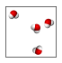
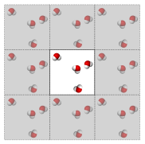
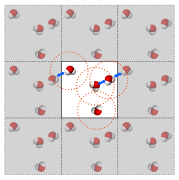
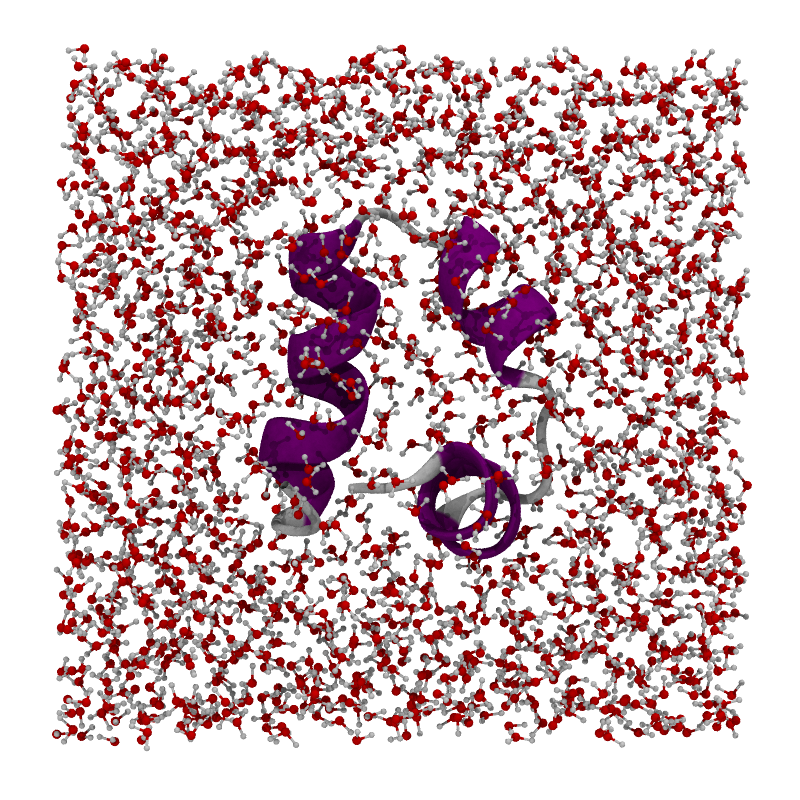
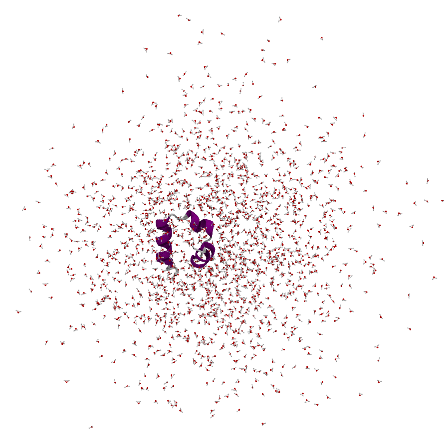
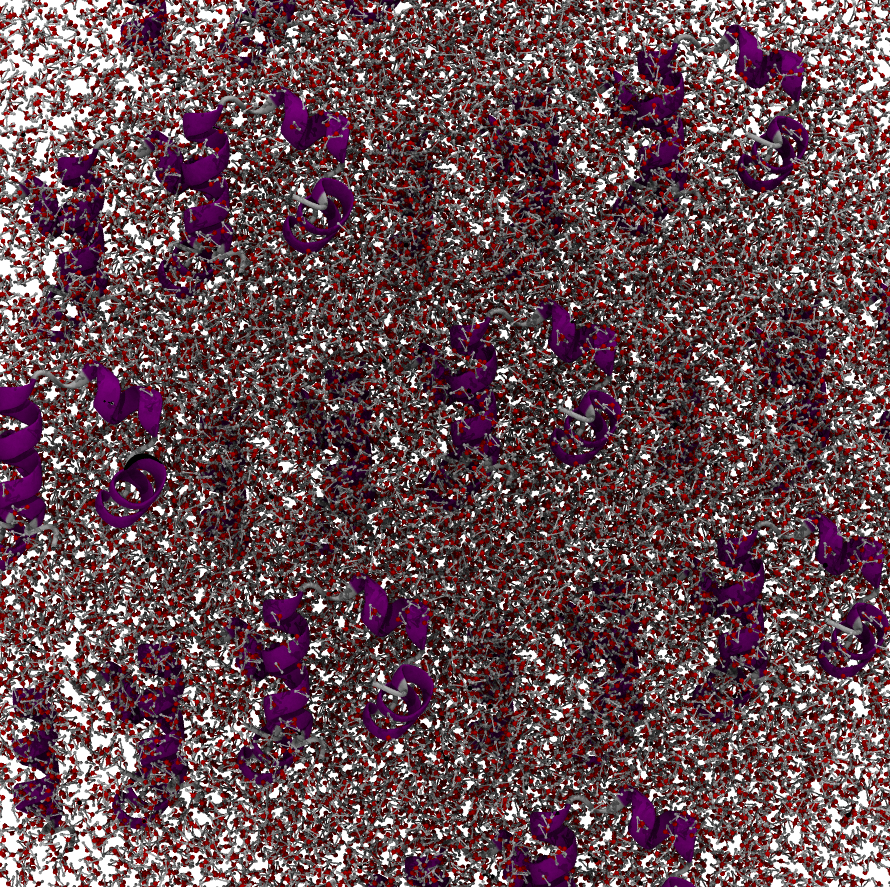
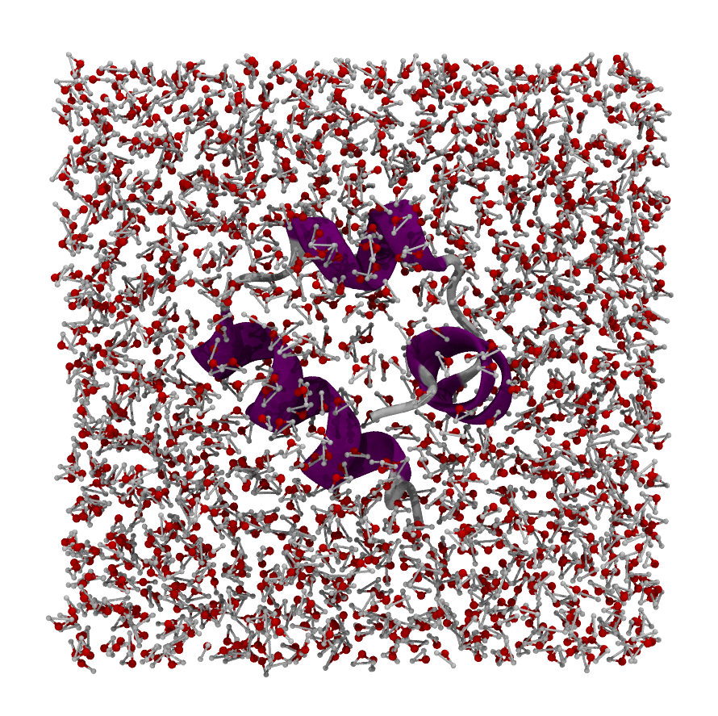
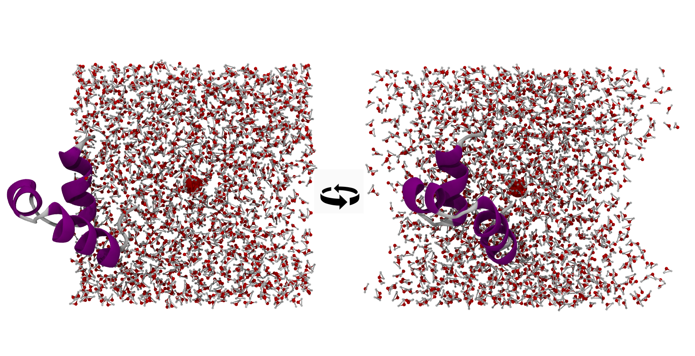
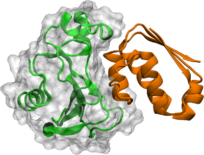
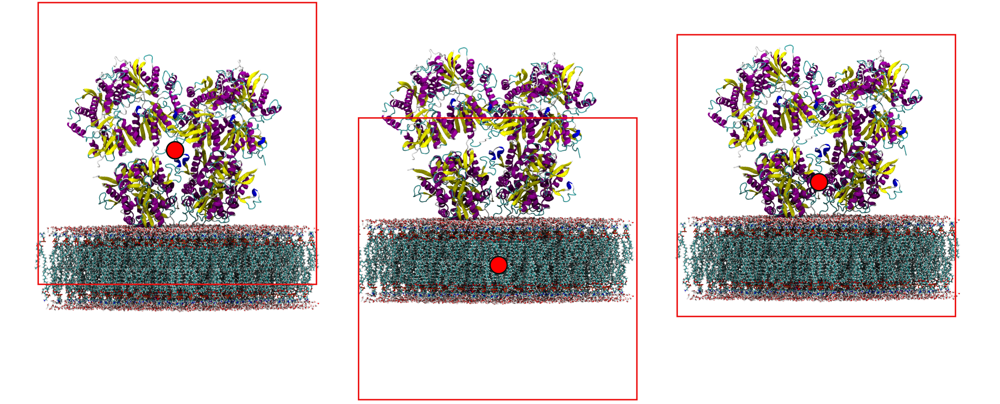

# Wrapping

During an MD simulation, molecules are free to drift across periodic boundaries.
The raw trajectory coordinates may then show a molecule "split" across two
sides of the box, which breaks visual inspection and distance calculations.

**Wrapping** re-images all atoms so that each bonded group (molecule or
residue) appears inside the central periodic image:

```python
mol.wrap("protein")   # center wrapping around the protein
```

The argument is an atom selection that defines the **center of the wrapping
box**. Passing `"protein"` puts the protein in the middle, so solvent molecules
wrap around it rather than the protein wrapping around them.

For the focused, MD-free recipe — parameters, common variations, and gotchas —
see [How to wrap trajectories](../how-to/wrap-trajectories.md). The rest of this
page explains *why* wrapping is needed and how to choose a good centre.

## Why atoms appear to "leave the box"

If you open a freshly run trajectory in a viewer and watch molecules drift out
of one face of the box, the simulation is almost certainly fine — what you are
seeing is an artifact of how MD engines store coordinates under periodic
boundary conditions.

MD simulations are computationally expensive: simulation time scales roughly
linearly with the number of atoms, so we keep systems small — typically a few
hundred thousand atoms. But a small isolated system does not reflect the reality
inside a cell, where molecules are surrounded by a vast amount of solvent.
**Periodic boundary conditions (PBC)** are how we approximate infinite solvent
without paying to simulate it.

When computing interactions we pretend the simulation box has identical copies
of itself on every side. Those copies have copies on theirs, and so on, tiling
all of space. These copies are the **periodic images** of the central box. Only
the central box is ever stored and integrated — the images are notional, used
only when computing forces across the box boundaries.

Consider a box with four water molecules:



When interactions are calculated we pretend there are identical copies on each
side (we never integrate those copies — that would be wasteful):



MD uses cutoffs for non-bonded interactions, which limit the distance an atom
"sees". Treating each water as a single point, if the orange circle is the
cutoff, each water interacts with every molecule inside its circle — including
atoms in neighbouring periodic images. That is how we approximate infinite
solvent:



When a molecule reaches the border of the box, an engine has two choices:

1. Teleport it to the opposite side of the box.
2. Let it keep moving past the boundary and record the absolute coordinates.

The first is visually pleasant but loses the ability to measure total atomic
drift and, done carelessly, can cause precision issues in force calculations.
The second is generally preferred: stored coordinates are never reset, and
interactions are still computed as if every atom sat in the central box. So an
atom "leaving" the box has **not** stopped interacting — it has simply moved
into the next periodic image, and the engine still treats it correctly.

For example, a villin protein built centred in a water box looks tidy at time
zero:



After running for a while it can look like this — normal, given the
absolute-coordinate storage strategy:



Rendering the periodic images directly (e.g. in VMD) shows the system atoms are
still interacting through the periodic copies — but it is hard to interpret with
so many copies around, which is why we prefer a single wrapped box:



Wrapping only affects the visual layout of the trajectory; it is never a sign of
a broken or exploding simulation.

## Choosing a good wrapping centre

One question remains: where is the centre of the box? The system drifts freely
during the simulation, so a fixed XYZ coordinate will not do. Instead, wrapping
defines the centre from **the coordinates of a chosen atom selection** — either
a single atom or the average over a set of atoms (this is the `wrapsel`
argument). The right choice depends on the system and on personal taste.

- **Single protein in solvent.** Wrap so the protein sits in the middle of the
  box, using the average coordinate of the protein (`mol.wrap("protein")`). The
  waters then wrap nicely around it:

  

  You can still get it wrong, e.g. by centring on a single water residue instead
  of the protein. The protein then sticks out of one face with "vacuum" on the
  others. There is no real vacuum — the protruding piece occupies that space in
  a periodic image — but moleculekit keeps bonded molecules intact rather than
  breaking bonds across the boundary, so the picture stays one-sided:

  

- **Two proteins.** Usually centre on one of them. The average of the two varies
  strongly during the simulation, so the effective centre shifts frame to frame.
  When the proteins are in contact the average works; for unbinding events,
  choose one or the other:

  

- **Protein and membrane.** The right centre depends on what you want to see.
  Centring on the protein wraps the membrane to the top; centring on the
  membrane wraps the protein to the bottom; picking a residue half-way between
  the two gives a clean visualization with both whole:

  

If your system is more complex than a single protein in solvent, visualize it in
your viewer, look around, and pick the residue or atom that gives the cleanest
picture (`mol.wrap("resid 15 and chain A")`). Once you find a selection that
works, apply the same one to every trajectory of the same setup.

## Practical guidance

- Wrap **after** loading a full trajectory, not before.
- Wrapping requires correct bonds (`mol.bonds`). Use a topology file that
  provides bonds, or call {py:func}`~moleculekit.bondguesser.guess_bonds` first.
- For trajectory analysis with {py:class}`~moleculekit.projections.metricdistance.MetricDistance` or `MetricCoordinate`,
  wrapping is usually needed before computing distances that span the periodic
  boundary.

## See also

- [Trajectories and frames](trajectories-and-frames.md) — the coordinate array, loading frames, and the periodic box fields.
- [How to wrap trajectories](../how-to/wrap-trajectories.md) — the task recipe.
